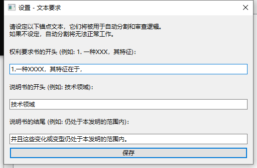

# Check-Check 专利形式审查专家系统 🔍

[](https://www.python.org/downloads/)
[](LICENSE)
[](https://www.riverbankcomputing.com/software/pyqt/)

Check-Check 是一款专为中国专利代理实务打造的高性能、现代化的本地形式审查桌面工具。它针对专利文件中极其隐性的“逻辑断层”与“附图标记错乱”建立了深层次的算法保障。



---

## ✨ 核心特性

- **🚀 高性能异步引擎**：基于 `PyQt6` 信号槽机制的多线程流式架构，处理百页超长文档不卡顿。
- **🧠 深度逻辑审查**：
    - **附图标记智能校验**：基于“最长公共后缀聚类算法”，自动区分专业术语与附图标记，消除误报。
    - **前序基础缺失校验**：滑动窗口扫描，智能豁免长修饰短语带来的判定偏差。
    - **引用合法性矩阵**：自动识别多引用多排雷、引用断层、环状引证等致命死循环。
- **🎨 极致交互体验**：
    - **无损实时高亮**：双侧文档同步染色。
    - **智能报告索引**：双击报告项自动跳转至源码处并锁定视野。
    - **主题定制系统**：内置暗色/亮色多套工作流主题，支持文本框及报告区颜色自由定制。
- **🛠️ 开放式字典系统**：支持用户实时修改 8 套核心检索“大脑”，即改即生效。

---

## 📂 项目结构

```text
check-check/
├── main.py              # 程序入口 (PyQt6 界面与业务分发)
├── settings.json        # 用户个人偏好、主题、锚点配置
├── requirements.txt     # 依赖声明
├── CheckCheck.spec      # PyInstaller 打包配置文件
├── src/                 # 核心模块源码
│   ├── document_parser.py   # 文档解析与自动切割
│   ├── rules_checker.py     # 核心专利审查逻辑算法库
│   ├── config.py            # 全局配置中心与字典加载器
│   └── nlp_engine.py        # 词法特征与术语提取引擎
└── dicts/               # 核心“大脑”词库
    ├── userdict.txt         # 自定义分词
    ├── minganci.txt         # 敏感词拦截
    ├── synonyms.txt         # 同义词映射表 (实现支撑验证)
    └── ...等 8 套子词库
```

---

## 🚀 快速开始

### 1. 克隆并安装依赖

推荐使用 Python 3.8+ 环境。建议使用 `uv` 或 `pip`：

```bash
# 克隆仓库
git clone https://github.com/vvangpc/check-check.git
cd check-check

# 安装依赖
pip install -r requirements.txt
```

### 2. 运行程序

```bash
python main.py
```

---

## 🔧 进阶配置与操作 tips

1. **首次使用锚点配置**：
   点击“设置 -> 文本要求”，填入本案常见的“权利要求书开头”、“说明书开头”等锚点词，以确保自动切割功能精准无误。
2. **字典实时补全**：
   如果您发现某些专业术语被误报，可以在“配置字典模型”中实时录入 `userdict.txt`。修改后，审查引擎会自动检测到文件变化并热更新。
3. **精准定位**：
   生成的智能报告中，**红色**代表致命错误（如引用不存在的项），**黄色**代表瑕疵或风险（如疑似敏感词）。

---

## 📦 如何打包为 EXE

我们将打包配置存放在了 `CheckCheck.spec` 中。您只需运行以下命令即可生成绿色单文件版本：

```bash
pip install pyinstaller
pyinstaller CheckCheck.spec
```
生成的文件位于 `dist/` 目录下。

---

## 📝 免责声明

本工具旨在辅助专利代理人员提高审查效率，降低低级错误排查成本。工具结果仅作参考，不代表绝对的法律意见，核心职业判断请以代理师人工审核为准。
